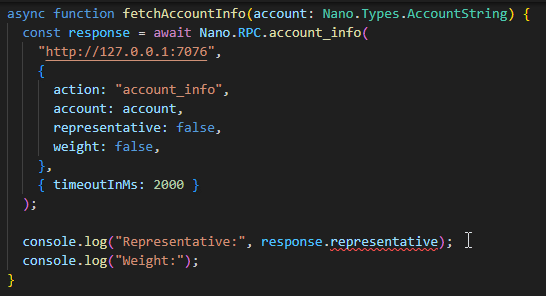
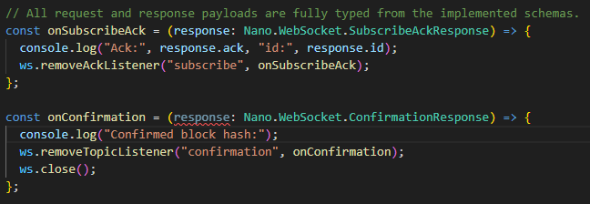

# nano-sdk

Production-grade TypeScript SDK for interacting with a **Nano** node, including typed and runtime-validated RPC methods, WebSocket message schemas, and utilities for blocks, crypto, and raw amount math.

## Installation

```bash
npm i nano-sdk zod
```

## Quick Start

```ts
import { Nano } from "nano-sdk";

const nanoRpcUrl = "http://127.0.0.1:7076";

// Alias
type AccountString = Nano.Types.AccountString;
const AccountString = Nano.Types.AccountString();

async function fetchAccountBalance(account: AccountString) {
  // 1) Validate user input
  const validatedAccount = AccountString.parse(account);

  // 2) Typed RPC call
  const response = await Nano.RPC.account_balance(
    nanoRpcUrl,
    {
      action: "account_balance",
      account: validatedAccount,
      include_only_confirmed: true,
    },
    { timeoutInMs: 2000 }
  );

  // 3) Convert and format raw balance
  const balanceInNano = Nano.Math.rawToNano({ raw: response.balance, decimalPlaces: 6 });

  // 4) Output balanceInNano
  console.log("Balance (Nano):", balanceInNano);
}

fetchAccountBalance("nano_3t6k35gi95xu6tergt6p69ck76ogmitsa8mnijtpxm9fkcm736xtoncuohr3").catch((err) => console.error("Unexpected failure:", err));
```

## Typed & Runtime-Validated RPC

RPC requests and responses are fully typed and validated at runtime. Response types are derived from the corresponding request parameters, meaning the shape of the response object adapts based on the options you provide.



## Overview & Features

The SDK uses a single root namespace (**Nano**), organized into sub-namespaces, each focused on a specific responsibility:

- `Nano.Blocks`: Block schemas (**Zod**) for validating and composing **Nano** blocks
- `Nano.Crypto`: Key derivation, block hashing, signing, and verification
- `Nano.Math`: Raw amount conversion, formatting, and safe raw arithmetic
- `Nano.RPC`: **Nano** node RPC methods (HTTP POST), with typed requests and typed responses
- `Nano.Types`: Runtime validators for common **Nano** primitives (account, hash, keys, raw amounts, etc.)
- `Nano.WebSocket`: **Zod** schemas/types for **Nano** node WebSocket topics

## RPC Usage

All RPC methods:

- validate requests using **Zod**
- perform an HTTP POST (default: native `fetch`)
- detect and handle post errors
- validate responses using **Zod**

All RPC methods follow a consistent signature:

`Nano.RPC.<method>(rpcUrl, request, config?)`

- `rpcUrl` – **Nano** node RPC endpoint
- `request` – typed request object (including `action`)
- `config` *(optional)* – request behavior and transport options

### Error Handling

By default, RPC calls throw `Nano.RPC.PostError` for:

- Invalid request payloads
- HTTP or transport errors
- **Nano** node error responses
- Invalid or unexpected response data

If `throwOnError` is set to false, the method instead returns a structured result object indicating success or failure.

### Request config

The optional config supports:

- `throwOnError` – true (default) throws, false returns `{ success, data / error }`
- `timeoutInMs` – HTTP timeout
- `abortSignal` – cancellation via AbortController
- `httpClient` – custom HTTP transport

By default, errors throw `Nano.RPC.PostError`.

### Custom HTTP client

RPC methods accept a custom `httpClient` via the request config. See the `axios` example in

- [`axios-http-client.example.ts`](https://github.com/infinitybay/nano-sdk/blob/master/examples/rpc/axios-http-client.example.ts)

## WebSocket Usage

`Nano.WebSocket` provides a complete, strongly typed implementation of all **Nano** node WebSocket request and response schemas and ships with a built-in `WebSocketClient`. By default, the client uses the globally available `WebSocket` implementation provided by the current runtime environment (browser or Node.js).

The `WebSocketClient` exposes **fully typed WebSocket interactions** through two complementary listener APIs:

- **Ack listeners** for handling typed acknowledgement messages returned by the node when a WebSocket action explicitly requests an acknowledgement (`subscribe`, `unsubscribe`, `update`, or `pong`)
- **Topic listeners** for typed streaming subscriptions, including `bootstrap`, `confirmation`, `new_unconfirmed_block`, `started_election`, `stopped_election`, `telemetry`, `work`, and `vote`

All incoming messages are validated and typed based on the corresponding WebSocket schemas, enabling safe, ergonomic access to response data without manual parsing or casting.



### Available options

```ts
const ws = new Nano.WebSocket.WebSocketClient(webSocketUrl, undefined, {
  webSocketClass: undefined, // WebSocket constructor, if none provided, defaults to global WebSocket
  connectionTimeout: 4000, // retry connect if not connected after this time, in ms
  minUptime: 5000, // min time in ms to consider connection as stable
  maxEnqueuedMessages: Infinity, // maximum number of messages to buffer until reconnection
  maxReconnectionAttempts: Infinity, // maximum number of reconnection attempts
  maxReconnectionDelay: 10000, // max delay in ms between reconnections
  minReconnectionDelay: 1000 + Math.random() * 4000, // min delay in ms between reconnections
  reconnectionDelayGrowFactor: 1.3, // how fast the reconnection delay grows
  startClosed: false, // start websocket in CLOSED state, call `.reconnect()` to connect
});
```

### Examples

- [`typed-ack-and-topic-listeners.example.ts`](https://github.com/infinitybay/nano-sdk/blob/master/examples/web-socket/typed-ack-and-topic-listeners.example.ts)
- [`custom-web-socket-client.example.ts`](https://github.com/infinitybay/nano-sdk/blob/master/examples/web-socket/custom-web-socket-client.example.ts)

## Validation & Typing

`Nano.Types` provides a collection of **reusable Zod schemas** for common **Nano-specific primitives**. These schemas form the foundation for higher-level features such as cryptography and RPC validation. Use them to validate external input and to type values throughout your codebase:

- Prefer `.parse(...)` when invalid input should throw immediately
- Prefer `.safeParse(...)` when you want a typed success/failure result without throwing

The available schemas cover a wide range of Nano primitives, including but not limited to:

- `AccountString`, `RawAmountString`, `NanoAmountString`, `PrivateKeyString`, `PublicKeyString`, `SignatureString`, `HashString`, `HexString`, ...

### Examples

- [`alias-and-safe-parse.example.ts`](https://github.com/infinitybay/nano-sdk/blob/master/examples/types/alias-and-safe-parse.example.ts)

## Math

`Nano.Math` provides safe arithmetic, comparison, and formatting utilities for **nano** and **raw** amounts.

**Raw** amounts can be represented as **strings** (`RawAmountString`, to remain JSON-serializable) and native `BigInt` values (`RawAmount`).

**Nano** amounts are represented as **strings** (`NanoAmountString`) to avoid precision issues and eliminate the need for a `BigNumber.js` dependency.

All raw functions support **mixed inputs** (`RawAmount` and `RawAmountString`).
The **type of the first parameter** of arithmetic functions determines the return type:
- If the first `raw` parameter is a `RawAmount` (`BigInt`), the result is returned as `BigInt`
- If the first `raw` parameter is a `RawAmountString` (`String`), the result is returned as `String`

Available utilities:

- Conversion: `nanoToRaw`, `rawToNano`
- Formatting: `formatRaw`
- Arithmetic (with bounds checking):  
  `rawPlus`, `rawMinus`, `rawMultiply`, `rawDivide`, `rawModulo`
- Comparisons:  
  `rawIsZero`, `rawIsGreaterThan`, `rawIsGreaterThanOrEqualTo`, `rawIsLessThan`, `rawIsLessThanOrEqualTo`, `rawIsEqualTo`

### Examples

- [`format-raw.example.ts`](https://github.com/infinitybay/nano-sdk/blob/master/examples/math/format-raw.example.ts)
- [`raw-arithmetic.example.ts`](https://github.com/infinitybay/nano-sdk/blob/master/examples/math/raw-arithmetic.example.ts)
- [`raw-comparison.example.ts`](https://github.com/infinitybay/nano-sdk/blob/master/examples/math/raw-comparison.example.ts)

## Crypto

`Nano.Crypto` provides cryptographic utilities commonly needed when building **Nano**-related services:

- Key pair generation and deterministic key derivation
- Block hashing and hash verification
- Block signing and signature verification
- Proof-of-work hash verification

### Examples

- [`derive-account-from-seed.example.ts`](https://github.com/infinitybay/nano-sdk/blob/master/examples/crypto/derive-account-from-seed.example.ts)
- [`hash-and-verify-hash.example.ts`](https://github.com/infinitybay/nano-sdk/blob/master/examples/crypto/hash-and-verify-hash.example.ts)
- [`sign-and-verify-signature.example.ts`](https://github.com/infinitybay/nano-sdk/blob/master/examples/crypto/sign-and-verify-signature.example.ts)

## Blocks

`Nano.Blocks` provides predefined Zod schemas for composing and validating **Nano** block variants. All schemas are provided as composable building blocks and can be used as a base to define extended schemas with additional custom fields.

Available block schemas:

- `StateBlock`
- `LegacySendBlock`, `LegacyReceiveBlock`, `LegacyOpenBlock`, `LegacyChangeBlock`
- `Block` as a union of all supported block variants

### Examples

- [`state-block-with-hash.example.ts`](https://github.com/infinitybay/nano-sdk/blob/master/examples/blocks/state-block-with-hash.example.ts)

## Testing

- Unit tests (`test/unit`) cover schemas, math edge cases, crypto utilities, and parsing/validation flows (throwing and non-throwing).
- Integration tests (`test/integration`) execute RPC calls against a real **Nano** node to verify request/response schemas with live responses.

Integration test requirements:

- A running **Nano** node is required.
- All public **Nano** RPC endpoints must be reachable. `enable_control=true` is **not** required for any currently enabled integration tests.
- The RPC URL can be configured either via the `config.nanoRpcUrl` field in package.json or via the `NANO_RPC_URL` environment variable. The environment variable takes precedence if both are set.

```bash
npm run test:unit
npm run test:integration
```

<a name="links"></a>
## Links

- npm: https://www.npmjs.com/package/nano-sdk
- GitHub: https://github.com/infinitybay/nano-sdk
